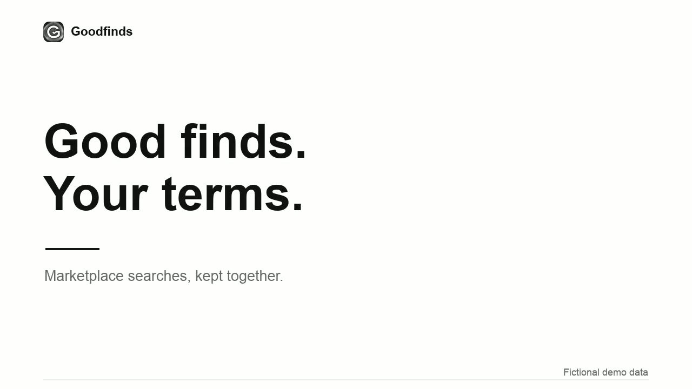

# Goodfinds

Goodfinds is a local MCP plugin for finding, comparing and following up on marketplace listings. Describe what you want to buy, refine the important requirements, and keep your searches, listing evidence and seller conversations together in an interactive panel.

[](https://github.com/hubab1/goodfinds/raw/refs/heads/main/website/media/goodfinds-demo.mp4)

[Watch the 38-second demo](https://github.com/hubab1/goodfinds/raw/refs/heads/main/website/media/goodfinds-demo.mp4) · [Video transcript](website/media/demo-captions.vtt)

The demo combines an illustrated conversation with actual Goodfinds panels. All searches, listings, prices and people are fictional; no seller is contacted.

## What it does

- Turns buying briefs into editable searches, with research, must-haves and preferences.
- Compares suitable listings using their specifications, condition, asking prices and saved evidence.
- Keeps photos, price history, shortlists and feedback so you can pick up where you left off.
- Supports one-off searches and recurring checks through your host's browser, background agents and scheduling tools.
- Prepares seller messages and collection arrangements for your review. Sending requires approval of the exact message; a saved draft never contacts a seller.

Goodfinds recognizes Facebook Marketplace, eBay, Vinted, Gumtree, UK Auto Trader and Craigslist. Available collection and contact routes differ by marketplace. Facebook uses host browser controls; eBay's Browse API requires application credentials. Other marketplaces support navigation and evidence import. Read [marketplace validation](docs/marketplace-validation.md) for current integration coverage and limitations.

## Run locally

Source builds require Rust 1.92 or later, a C compiler, and Bun 1.4.2 or later for the UI and shared contracts. Installed plugins need none of these tools.

```sh
bun install
bun run build
bun start
```

Open the device-local URL printed by the server to use the panel. New live workspaces start empty; demo mode supplies fictional searches and listings. Use `bun run dev` for panel development.

To build an installable plugin:

```sh
bun run package
bun scripts/smoke-plugin.ts dist/goodfinds-marketplace
```

The package contains a native Rust executable with SQLite and the UI embedded, plus the [marketplace-shopping skill](skills/marketplace-shopping/SKILL.md). Load `dist/goodfinds-marketplace` through your MCP host's local plugin support; `plugin.json` and `mcp.json` define the plugin and server. Browser actions require compatible host tools. Recurring checks require a host schedule, an awake device and a running host app.

Each package targets one operating system and CPU, recorded in its ZIP filename. Packaging defaults to the build machine. macOS, Windows and Linux targets are configured for ARM64 and x64; cross-compilation requires the target linker and SDK. See [packaging](docs/packaging.md) for target selection and platform requirements. Validate each package on its target platform before distribution.

## Your data

Searches, evidence and conversations stay in the local workspace at `~/.local/share/goodfinds`. Set `GOODFINDS_WORKSPACE_DIR` to use another location. Demo initialization uses fictional data and never reads the live database. Marketplace credentials and browser sessions remain separate from saved searches.

```sh
./dist/goodfinds-marketplace/server/goodfinds backup --db /absolute/path/workspace.sqlite --output /absolute/path/new-backup
./dist/goodfinds-marketplace/server/goodfinds restore --input /absolute/path/new-backup --output /absolute/path/new-workspace
```

Backups include committed databases, cached media and connection checks, with integrity verification. Restore creates a new directory. Host schedules and credentials remain with the host. Development output, builds, local databases and secrets are excluded from Git.

## Development

The TypeScript UI and Rust server share validated JSON contracts generated from `packages/contracts`. A contract change is checked on both sides of the MCP interface. Start with [server architecture](docs/server-architecture.md), [interface design](docs/ui-design.md) and [domain vocabulary](CONTEXT.md). The [roadmap](docs/roadmap.md) tracks open work.

```sh
bun run docs:generate # after changing shared state definitions
bun run check
bun test ./tests/*.ts
bun run test:native
```

Validation includes a focused seller-send specification using a pinned Lean toolchain. Install [elan](https://lean-lang.org/install/) and follow the [formal model guide](formal/README.md). The model checks permission and reconciliation guarantees; live browser integrations require separate validation.

## Website and demo

The promotional site is static HTML, CSS and JavaScript in `website/`. Preview it with any static server, for example `python3 -m http.server 5055 --directory website`. It has no framework, external fonts, analytics or build step.

To regenerate the demo from the fictional sample screenshots, install FFmpeg with `libx264` and `drawtext`, then run `bun scripts/render-promo.ts`. The video, poster and captions are written to `website/media/`; intermediate renders stay in ignored `output/promo-render/`. Capture replacement screenshots only from an isolated sample workspace.
