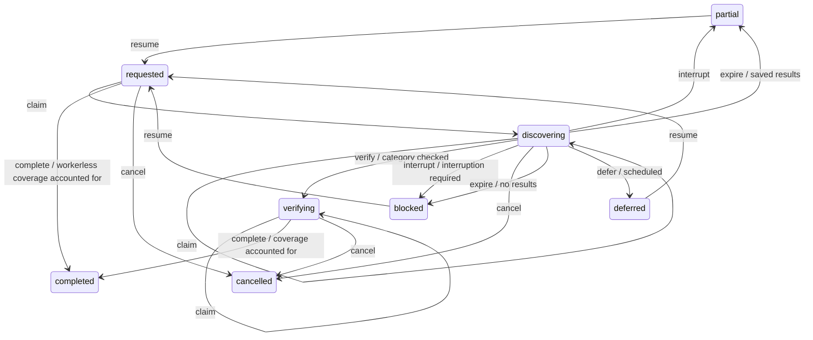
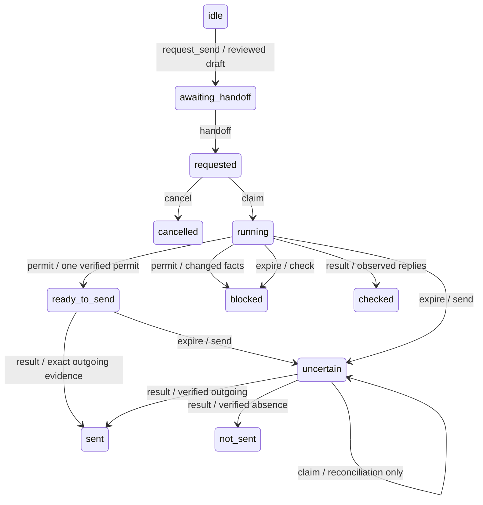

# State model and available actions

<!-- Generated by bun run docs:generate. Edit the shared model definitions, not this file. -->

This reference is generated from executable shared definitions. `workflow.actions` is the authoritative guidance: `available` means known guards pass, `requires_input` means input or evidence is missing, and `blocked` means a known guard fails. Each descriptor names an event, canonical operation/tool, required inputs, conditions, stable blocker codes and an execution profile with native worker launch settings. `allowed_actions` is a compatibility list of tools that can be proposed, including tools that still need input; it is not execution permission.

Read `search_workflows[search_id]` and `search_run_workflows[run_id]` in search context, or the run map in full progress reads. `progress_only: true` keeps polling compact and returns an empty workflow map. Mutation results include `workflow`. Read `get_goodfinds_listing` with optional `search_id` for scoped assessments and action guidance. Workflow fields are derived response views; SQLite persists the existing domain documents, versions and leases, not these views. The clock is supplied explicitly to guards and projections.

A fresh `execution.send_permitted: true` from `issue_goodfinds_message_send_permit` is the only browser send permit. It applies once to the saved exact text and verified identity. A descriptor, draft, claim, host handoff or replayed response cannot grant another permit. User review is a caller/host responsibility; the server does not infer authorization from lifecycle state.

## Worker model routing

Source: `packages/contracts/src/worker-execution.ts`. These profiles choose the host agent doing the surrounding evidence work; MCP tools still execute ordinary server code. Apply `action.execution.spawn` when dispatching new worker work. Existing workers keep their model across renewal, progress and persistence calls; those calls never require spawning an agent or switching models. The host must honor the settings; MCP metadata alone cannot switch the calling model.

| Profile      | Launch overrides                                                        | Scope                                                                                        |
| ------------ | ----------------------------------------------------------------------- | -------------------------------------------------------------------------------------------- |
| `chat`       | Omit model and reasoning overrides; inherit the buying chat             | Use the buying chat's model and reasoning for decisions and judgment.                        |
| `collection` | `{"model":"gpt-6-luna","reasoning_effort":"xhigh","fork_turns":"none"}` | Collect explicit facts and media against a saved brief; return ambiguity to the buying chat. |

| Work                | Profile      | Completion                                                                                                        |
| ------------------- | ------------ | ----------------------------------------------------------------------------------------------------------------- |
| `connection_check`  | `collection` | Observe browser control and marketplace sign-in in a claimed read-only native subagent check.                     |
| `search_collection` | `collection` | Discover listings, paginate and extract sourced facts from the saved query plan.                                  |
| `listing_evidence`  | `collection` | Inspect saved shortlist evidence against explicit checks and preserve unknowns or conflicts.                      |
| `media_repair`      | `collection` | Recover listing photos and videos without rewriting fact timestamps or review coverage.                           |
| `contact_check`     | `collection` | Observe the selected listing's contact interface and browser identity.                                            |
| `reply_check`       | `collection` | Read the verified seller thread and record exact replies with supporting evidence.                                |
| `buying_judgment`   | `chat`       | Interpret preferences, research product tradeoffs, compare options and resolve ambiguous or conflicting evidence. |
| `seller_message`    | `chat`       | Review wording, negotiate and perform an exact reviewed send under its existing permit.                           |
| `monitoring`        | `chat`       | Make setup and scheduling choices in the original buying chat.                                                    |

Collection workers start with bounded explicit context (`fork_turns: none`) so the host can apply the requested model override. Supply the saved brief, query/check scope, IDs, shared paths, installed skill and browser route. Verify the worker's actual browser and media tools. If overrides or the requested model are unavailable, omit overrides, inherit the buying chat and report the fallback; preserve existing interruption handling when delegation or browser access is unavailable. Connection checks use the same host-subagent dispatch policy and record unavailable when delegation cannot start; there is no foreground browser fallback or plugin-owned agent runtime.

Keep unknowns and conflicts in saved evidence. The buying chat handles interpretation, final comparisons, seller wording/sends and scheduling. Collection workers return specific unresolved questions without loosening requirements or guessing. A conflicting listing's observation action uses the chat profile; media recovery can still use collection. Seller check claims/results use collection; send execution retains chat settings and its existing reviewed permit.

Search, connection-check and seller claim inputs accept optional `execution: {profile, model, reasoning_effort?}` containing actual host-reported settings. These are stored with the worker claim or seller action and survive reconnects. They are not a recommendation, a model-switch mechanism, proof of inference quality or a send permission. Omit unknown settings; existing records remain valid without them. A resumed search clears the old worker; a new seller executor replaces its execution record.

## Connection checks

Source: `packages/contracts/src/connection-checks.ts`.

| State         | Meaning                                                   | Safety context                                                              | Recovery                                                                           |
| ------------- | --------------------------------------------------------- | --------------------------------------------------------------------------- | ---------------------------------------------------------------------------------- |
| `queued`      | Waiting for a native subagent claim.                      | No browser work or verified observations yet.                               | Dispatch one scoped subagent; record unavailable if delegation fails.              |
| `running`     | A worker owns the read-only check.                        | A live worker claim is required for renewal and completion.                 | Reuse the claimed worker; stop on cancellation, expiry or a changed browser route. |
| `complete`    | Validated observations have been saved.                   | Unchecked targets remain unknown; public access does not establish sign-in. | Start a new check to refresh or cover unchecked targets.                           |
| `unavailable` | Delegation or the selected browser route is unavailable.  | No fabricated account evidence or foreground fallback.                      | Resolve the recorded limitation, then start a new check.                           |
| `cancelled`   | The buyer stopped the check.                              | Further claims and result writes are rejected.                              | Keep prior evidence; start a new check if requested.                               |
| `failed`      | The check could not finish.                               | A failure is not proof of sign-out.                                         | Read the reason and retry with a new check.                                        |
| `interrupted` | Dispatch or a worker lease expired, or execution stopped. | The expired worker cannot save late results.                                | Preserve evidence and start a new check.                                           |

| Tool                                   | Purpose                                                                                                                                                                                                                                                                                                                                                                                                                                                                                  |
| -------------------------------------- | ---------------------------------------------------------------------------------------------------------------------------------------------------------------------------------------------------------------------------------------------------------------------------------------------------------------------------------------------------------------------------------------------------------------------------------------------------------------------------------------- |
| `start_goodfinds_connection_check`     | Queue a read-only check of selected enabled marketplaces in their saved browser routes. This tool does not launch or browse. The parent must dispatch a native background subagent using references/background-work.md#connection-checks and the returned execution settings, then return promptly. Reuse a running worker; if delegation fails, interrupt the queued check as unavailable without foreground browsing. Use a fresh request_id for new work and the same ID for retries. |
| `get_goodfinds_connection_check`       | Read one durable connection check, or the latest in the current access context. Queued means dispatch is pending; only a worker claim establishes running. Check current status before each browser step. Expired, cancelled or changed-context checks cannot accept results.                                                                                                                                                                                                            |
| `claim_goodfinds_connection_check`     | Called by the dispatched native subagent before browser work. Claim the exact queued check with its current version, fresh worker_id and actual host-provided agent_id. Reuse a matching existing claim; never invent a native identity. Optional execution records actual host-reported model/effort. Identity is caller-reported, not host attestation.                                                                                                                                |
| `renew_goodfinds_connection_check`     | Renew the owning worker's connection-check lease at least once a minute and before/after slow browser steps. Read the returned version before completion. A cancelled or expired claim cannot be revived; keep the main chat available.                                                                                                                                                                                                                                                  |
| `complete_goodfinds_connection_check`  | The claimed subagent saves paired observed browser-access and sign-in evidence for the selected routes using its worker_id and current version. Verify actual host/browser/profile identity; public access does not prove sign-in. Unsupported targets may be omitted and remain unknown. Do not use standalone access/session reporting tools to bypass this job's cancellation and ownership checks.                                                                                   |
| `interrupt_goodfinds_connection_check` | Record the actual delegation/browser limitation or failure. The parent may stop an unclaimed queued check; a running check requires the owning worker_id. Use unavailable for missing delegation or browser capability. Preserve previous account evidence and selected routes; do not perform a foreground fallback.                                                                                                                                                                    |
| `cancel_goodfinds_connection_check`    | Cancel a queued or running connection check. The worker must stop at its next status/lease check and close only its own tabs. Further result writes are rejected. Does not sign out, change permissions or discard previous evidence.                                                                                                                                                                                                                                                    |

Settings queues a check and sends a host message requesting native subagent dispatch. Only a claim moves queued to running. Parent dispatch failure may interrupt an unclaimed job; running completion/interruption requires the owning worker. Queued dispatch and worker leases expire after two minutes; claimed checks also have a five-minute maximum. Reuse running workers, preserve the selected browser, and stop on cancellation or expiry. Native identity and execution metadata are caller-reported audit evidence, not attestation. Read [connection-check execution](background-work.md#connection-checks) before dispatch.

## Search runs

Source: `packages/contracts/src/search-run-model.ts`.

| State         | Meaning                                                                     | Safety context                                                                                                                    | Recovery                                                                         |
| ------------- | --------------------------------------------------------------------------- | --------------------------------------------------------------------------------------------------------------------------------- | -------------------------------------------------------------------------------- |
| `requested`   | A durable query plan awaits execution.                                      | Saved results and query identities survive reconnects.                                                                            | Claim with the actual spawned agent_id, a new worker_id and current run version. |
| `discovering` | Query discovery is in progress.                                             | A worker, when present, owns an unexpired lease.                                                                                  | Import discoveries in batches and report query coverage.                         |
| `verifying`   | The broad category has been checked; shortlist evidence is being collected. | At least one broad category query is completed.                                                                                   | Record gallery reviews separately from saved media.                              |
| `partial`     | Execution stopped with saved results or incomplete coverage.                | Completion is not claimed; saved evidence remains available.                                                                      | Resume with a new real background agent after resolving the interruption.        |
| `completed`   | Query coverage is accounted for.                                            | A category query is completed and no query is planned, running or failed. This does not prove listing verification or a purchase. | Read saved listings and buying next steps, or request a new run.                 |
| `blocked`     | Execution cannot proceed.                                                   | An interruption explains the blocker.                                                                                             | Resolve the interruption, then resume with a new worker.                         |
| `cancelled`   | The run was stopped deliberately or its buying goal was fulfilled.          | Results remain saved; this run accepts no further progress or imports.                                                            | Request a new run for an unfulfilled buying goal.                                |
| `deferred`    | Scheduled execution waits for eligibility or active hours.                  | Monitoring preference and observed host schedule remain separate from run phase.                                                  | Recheck scheduled-search eligibility before resuming.                            |

### Action meanings

| Action      | Tool                                    | Purpose                                                                                                |
| ----------- | --------------------------------------- | ------------------------------------------------------------------------------------------------------ |
| `request`   | `request_goodfinds_search_run`          | Create a query plan; repeated requests return the saved run.                                           |
| `resume`    | `request_goodfinds_search_run`          | Preserve queries/results and clear the previous worker and interruption.                               |
| `claim`     | `claim_goodfinds_search_run`            | Claim or renew an active run; requested becomes discovering.                                           |
| `renew`     | `renew_goodfinds_search_lease`          | Renew the current worker lease.                                                                        |
| `progress`  | `update_goodfinds_search_run`           | Update the candidate query plan and phase atomically. Existing workerless execution remains supported. |
| `verify`    | `update_goodfinds_search_run`           | Begin shortlist verification after category coverage.                                                  |
| `complete`  | `update_goodfinds_search_run`           | Complete coverage, independently of listing evidence and buying outcome.                               |
| `interrupt` | `update_goodfinds_search_run`           | Save partial progress or explain an interruption.                                                      |
| `import`    | `import_goodfinds_listing_observations` | Save observations and run keys in the same transaction; failed guards roll back the batch.             |
| `cancel`    | `cancel_goodfinds_search_run`           | Stop execution without discarding results. Repeated cancellation is harmless.                          |
| `expire`    | Internal lifecycle event                | Expired execution becomes partial with results, otherwise blocked. Reads project this without writing. |
| `defer`     | Internal lifecycle event                | Stop scheduled execution when eligibility changes.                                                     |
| `fulfil`    | Internal lifecycle event                | A recorded purchase fences linked buying goals and their runs.                                         |
| `inspect`   | `list_goodfinds_search_runs`            | Read progress and available actions without advancing a run.                                           |

Use the returned workflow for current transitions, required inputs and blockers; [tool contracts](tool-contracts.md) explains the wire format. This reference explains why actions exist and how to recover. Updates evaluate query changes in the same call. Terminal retries may return an existing result without transitioning.

| Blocker code                | Meaning                                                                                          | Recovery                                                                                      |
| --------------------------- | ------------------------------------------------------------------------------------------------ | --------------------------------------------------------------------------------------------- |
| `run_stopped`               | This search is stopped. Start or resume a run first.                                             | Read the run and resume with a new worker before worker activity.                             |
| `run_finished`              | This run has finished and stopped. Start a new run.                                              | Read saved results or request a new run.                                                      |
| `revision_conflict`         | Search progress changed. Read the run before updating or claiming it.                            | Use the returned run version for progress updates and new claims.                             |
| `search_changed`            | The buying brief changed. Start a new search run.                                                | Read the saved search and request a run for its current brief.                                |
| `search_missing`            | Choose a saved search.                                                                           | Read the saved searches.                                                                      |
| `goal_fulfilled`            | This buying goal is fulfilled.                                                                   | Reopen the purchased conversation before searching again.                                     |
| `scheduled_ineligible`      | Scheduled execution is not currently eligible.                                                   | Read check_goodfinds_scheduled_search before scheduled execution.                             |
| `worker_required`           | Claim this search before reporting activity.                                                     | Claim with the actual spawned agent identity and current version.                             |
| `worker_mismatch`           | This background search is owned by another agent or has stopped. Read the run before continuing. | Use the current worker_id, unexpired lease and unchanged search brief.                        |
| `lease_expired`             | The background search lease expired.                                                             | Read the run, resolve the interruption and resume with a new worker.                          |
| `execution_input`           | Supply the proposed progress or observation evidence.                                            | Use original query identities and a stable request_id for each import batch.                  |
| `request_input`             | Supply a search request and fresh request_id.                                                    | Use the saved search_id, a fresh request_id and the intended manual or scheduled trigger.     |
| `claim_input`               | Supply the real spawned agent_id and worker_id.                                                  | The parent cannot claim for the worker; pass the spawned agent's identity.                    |
| `category_query_unchecked`  | Check a broad category query before shortlist verification.                                      | Complete a broad category query; query and phase may be updated together.                     |
| `query_coverage_incomplete` | Complete a broad category query and account for remaining queries, or mark this run partial.     | Complete queries or skip them with reasons. Failed queries require recovery or a partial run. |
| `interruption_required`     | Explain the search interruption.                                                                 | Provide an interruption when marking a run blocked.                                           |
| `transition_invalid`        | This event does not allow that search phase.                                                     | Read the run's action descriptors and choose an applicable event.                             |

## Seller actions

Source: `packages/contracts/src/seller-action-model.ts`.

| State              | Meaning                                                              | Safety context                                                                 | Recovery                                                                |
| ------------------ | -------------------------------------------------------------------- | ------------------------------------------------------------------------------ | ----------------------------------------------------------------------- |
| `awaiting_handoff` | An immutable reviewed action is saved for host handoff.              | The draft is bound to this action; no send permission exists.                  | Report host acceptance or cancel before execution.                      |
| `requested`        | Host accepted the action; browser execution is pending.              | Handoff does not prove a message was sent.                                     | Verify browser access and sign-in, then claim.                          |
| `running`          | An executor holds a lease and must verify the thread.                | Claiming never grants permission to send.                                      | For send, request one permit; for check, report observed replies.       |
| `ready_to_send`    | A single-use permit was issued for exact text and identity.          | No second permit may be issued. A workflow descriptor never grants permission. | Report evidence from the verified thread. Reconcile after interruption. |
| `sent`             | The exact outgoing message was observed or reported by the user.     | Provenance distinguishes browser evidence from user reports.                   | Check replies or prepare a new reviewed action.                         |
| `checked`          | A verified thread was inspected for replies.                         | Message identity and classification evidence are preserved.                    | Review new replies before further outreach.                             |
| `not_sent`         | The stopped action has evidence that no outgoing message was sent.   | A send requires verified thread identity to record this result.                | Prepare a new reviewed action if still wanted.                          |
| `uncertain`        | An interrupted send might have reached the seller.                   | It cannot be resent, cancelled or granted another permit.                      | Claim a reconciliation lease and inspect the same thread.               |
| `blocked`          | Execution stopped before a potential send, or a check lease expired. | Potentially sent messages remain uncertain instead.                            | Resolve the blocker, cancel or claim again.                             |
| `cancelled`        | The action was cancelled before sending.                             | Cancellation cannot erase an uncertain send.                                   | Prepare a new action if needed.                                         |

### Action meanings

| Action            | Tool                                     | Purpose                                                                                                                |
| ----------------- | ---------------------------------------- | ---------------------------------------------------------------------------------------------------------------------- |
| `save_draft`      | `save_goodfinds_seller_message_draft`    | Save reviewed wording without creating an execution action.                                                            |
| `collection_plan` | `save_goodfinds_collection_plan`         | Persist collection terms and their confirmation evidence, separately from buying outcome.                              |
| `arrange`         | `prepare_goodfinds_collection_message`   | Prepare wording from the saved plan and unresolved questions.                                                          |
| `request_send`    | `request_goodfinds_seller_action`        | Record the exact reviewed draft. Authorization remains the caller's responsibility; this grants no permit.             |
| `request_check`   | `request_goodfinds_seller_action`        | Request observation of replies.                                                                                        |
| `handoff`         | `report_goodfinds_seller_action_handoff` | Record host acceptance; subsequent reports are harmless.                                                               |
| `cancel`          | `cancel_goodfinds_seller_action`         | Cancel only before a possible send.                                                                                    |
| `claim`           | `claim_goodfinds_seller_action`          | Claim execution or reconciliation. Claiming never grants a send permit.                                                |
| `permit`          | `issue_goodfinds_message_send_permit`    | Issue one permit after exact identity and draft checks, or pause before sending if facts changed.                      |
| `result`          | `report_goodfinds_seller_action_result`  | Record observed results; terminal confirmations are idempotent. Uncertain results require reconciliation.              |
| `outcome`         | `set_goodfinds_buying_outcome`           | Record open/bought/withdrawn/unavailable independently of conversation phase. Only bought fulfils a buying goal.       |
| `inspect`         | `get_goodfinds_seller_conversation`      | Read conversation phase, buying outcome and execution guidance. Existing expired actions are reconciled by the server. |
| `expire`          | Internal lifecycle event                 | An expired send becomes uncertain; an expired check becomes blocked.                                                   |

Use the returned workflow for current transitions, required inputs and blockers; [tool contracts](tool-contracts.md) explains the wire format. This reference explains why actions exist and how to recover. Updates evaluate query changes in the same call. Terminal retries may return an existing result without transitioning.

| Blocker code             | Meaning                                                                                                             | Recovery                                                                                                                      |
| ------------------------ | ------------------------------------------------------------------------------------------------------------------- | ----------------------------------------------------------------------------------------------------------------------------- |
| `conversation_changed`   | Conversation changed elsewhere. Refresh it before editing or sending.                                               | Read the conversation and use its current version.                                                                            |
| `conversation_closed`    | Reopen the conversation before another action.                                                                      | Record an open buying outcome before new outreach.                                                                            |
| `pending_action`         | An action already exists. Continue or reconcile the pending send or check before requesting another.                | Resolve or cancel the pending action before creating more work.                                                               |
| `pending_send`           | Resolve or cancel the pending send before changing its draft.                                                       | Keep the approved draft and collection terms immutable during a send.                                                         |
| `draft_missing`          | Save and review a message first.                                                                                    | Save the exact reviewed wording before requesting a send.                                                                     |
| `collection_expired`     | Update the expired collection time before sending.                                                                  | Update collection terms and obtain review of the new draft.                                                                   |
| `availability_unchecked` | Recheck availability before contacting this seller.                                                                 | Observe an active listing before requesting a send permit.                                                                    |
| `reply_unreviewed`       | The latest seller reply needs review first.                                                                         | Review the latest reply and bind the draft's responds_to to it.                                                               |
| `contact_unverified`     | Check this listing's message interface before preparing outreach. Native offers use the platform offer interface.   | Observe this listing's contact options in the current browser context.                                                        |
| `marketplace_disabled`   | This marketplace is disabled in Settings.                                                                           | Enable the selected marketplace before browser execution.                                                                     |
| `manual_only`            | This marketplace currently supports copy/open and manual history.                                                   | Use manual history for sample and unsupported marketplaces.                                                                   |
| `browser_unverified`     | Check browser access in Settings before this action.                                                                | Observe fresh browser access in this server context.                                                                          |
| `signin_unverified`      | Facebook messaging requires verified sign-in in this browser profile.                                               | Verify sign-in in the saved buyer, host and browser profile.                                                                  |
| `executor_active`        | This action already has an active executor.                                                                         | Wait for the current executor or reconcile after its lease expires.                                                           |
| `lease_expired`          | Execution lease expired. Claim and reconcile the conversation before continuing.                                    | Claim a current lease token; reconcile an interrupted send before repeating anything.                                         |
| `lease_input`            | Supply the current lease token.                                                                                     | Use the token from the current claim, never a previous executor's token.                                                      |
| `permit_already_issued`  | This action cannot issue another send permit; reconcile the thread first.                                           | Send only after prepare returns a fresh execution.send_permitted true; never reuse or request a second permit.                |
| `sample_only`            | Sample conversations support manual practice only; no browser action is permitted                                   | Use manual history in sample mode.                                                                                            |
| `listing_identity`       | The observed listing does not match the approved item                                                               | Return to the approved canonical item URL and listing ID.                                                                     |
| `seller_identity`        | The seller does not match this listing                                                                              | Verify the seller attached to the approved listing.                                                                           |
| `profile_mismatch`       | Verify sign-in in the chosen browser profile before this action                                                     | Verify buyer sign-in and contact observations in the same host and profile.                                                   |
| `identity_unverified`    | Verify the seller and thread before confirming.                                                                     | Verify listing, seller, buyer, host, profile and thread identity.                                                             |
| `identity_mismatch`      | Verify the existing seller, buyer and conversation in the same browser profile.                                     | Return to the approved listing and established seller thread.                                                                 |
| `evidence_required`      | Confirm the exact outgoing message in the verified thread.                                                          | Report observed evidence and exact text; classification needs supporting seller words.                                        |
| `action_unclaimed`       | Claim this action first.                                                                                            | Claim a browser or reconciliation lease before reporting the result.                                                          |
| `uncertain_send`         | Verify an interrupted send before cancelling it; a potentially sent message must remain uncertain until reconciled. | Inspect the verified thread; do not resend or cancel an uncertain send.                                                       |
| `executor_input`         | Supply the executor's worker_id.                                                                                    | Use the actual browser executor's identity.                                                                                   |
| `review_required`        | Sending requires explicit authorization of the exact reviewed text.                                                 | Obtain user review of the saved wording. Request records that wording; the server cannot infer user authorization from state. |
| `input_required`         | Supply the proposed action inputs.                                                                                  | Read the operation schema and supply its required inputs.                                                                     |

## Listings

Source: `packages/contracts/src/listing-model.ts`.

### availability

| State         | Meaning                                                               | Safety context                                               | Recovery                                             |
| ------------- | --------------------------------------------------------------------- | ------------------------------------------------------------ | ---------------------------------------------------- |
| `active`      | The latest successful observation says active.                        | Freshness and conflicts are separate evidence checks.        | Recheck before outreach if quality flags require it. |
| `reserved`    | The seller reports reserved.                                          | Reserved is not confirmed active or purchased by this buyer. | Observe current availability.                        |
| `unavailable` | The observed item is sold, removed, expired or otherwise unavailable. | The original availability value remains in the listing.      | Search for alternatives.                             |
| `unknown`     | Availability has not been established.                                | Missing evidence is not proof of unavailability.             | Observe the listing.                                 |

### evidence

| State         | Meaning                                            | Safety context                                                       | Recovery                                                |
| ------------- | -------------------------------------------------- | -------------------------------------------------------------------- | ------------------------------------------------------- |
| `discovery`   | Only provisional discovery has been recorded.      | Discovery cannot establish a complete gallery review.                | Inspect the listing and unresolved checks.              |
| `needs_check` | Verification has unresolved or missing details.    | Unknown, missing and conflicting checks retain distinct meanings.    | Read check evidence and resolve the specific questions. |
| `conflicting` | Saved facts or verification checks disagree.       | Do not silently resolve conflicts by saving media.                   | Reinspect the conflicting fields.                       |
| `resolved`    | Every represented verification check is confirmed. | Search-specific evaluation and availability quality remain separate. | Review the per-search next step.                        |

### media

| State         | Meaning                                                 | Safety context                                          | Recovery                                                |
| ------------- | ------------------------------------------------------- | ------------------------------------------------------- | ------------------------------------------------------- |
| `pending`     | Saved gallery capture is incomplete or unknown.         | Capture does not imply review.                          | Use the repair queue after discovery; respect retry_at. |
| `unavailable` | The last capture attempt could not recover the gallery. | Failed media recovery does not rewrite fact timestamps. | Retry when the queue is ready.                          |
| `complete`    | The represented gallery is saved.                       | Image and video review coverage remains independent.    | Review the saved images and videos.                     |

### assessment

| State         | Meaning                                                | Safety context                                                | Recovery                                                         |
| ------------- | ------------------------------------------------------ | ------------------------------------------------------------- | ---------------------------------------------------------------- |
| `suitable`    | A listing meets one saved search's known requirements. | Suitability does not prove verification, value or purchase.   | Read verification, value and next-step guidance for this search. |
| `possible`    | Some required facts need confirmation.                 | One search's assessment does not apply to another search.     | Resolve the search-specific unknowns.                            |
| `unsuitable`  | Known facts fail one search's requirements.            | Other searches may still consider the listing suitable.       | Review reasons or refine that search.                            |
| `unevaluated` | No current evaluation exists for this search.          | Do not infer suitability from another search or old evidence. | Refresh search coverage and evidence.                            |

Assessments reuse the existing evaluator, scoped feedback and prepared buying next steps. Gallery capture uses the same calculation as the media repair queue. Saved media never establishes image/video review or refreshes price/availability timestamps.

### Action meanings

| Action                 | Tool                                    | Purpose                                                                      |
| ---------------------- | --------------------------------------- | ---------------------------------------------------------------------------- |
| `observe`              | `import_goodfinds_listing_observations` | Append observations and reevaluate with existing matching and quality rules. |
| `recover_media`        | `attach_goodfinds_listing_media`        | Recover a saved gallery independently of fact observation and review.        |
| `feedback`             | `record_goodfinds_listing_feedback`     | Record dismissal/shortlist/preference in its explicit scope.                 |
| `inspect_repairs`      | `list_goodfinds_media_repairs`          | Read recovery readiness and retry time before repeating browser capture.     |
| `inspect_conversation` | `get_goodfinds_seller_conversation`     | Read seller execution, conversation phase and buying outcome separately.     |

Use the returned workflow for current transitions, required inputs and blockers; [tool contracts](tool-contracts.md) explains the wire format. This reference explains why actions exist and how to recover. Updates evaluate query changes in the same call. Terminal retries may return an existing result without transitioning.

| Blocker code     | Meaning                                                  | Recovery                                                                                            |
| ---------------- | -------------------------------------------------------- | --------------------------------------------------------------------------------------------------- |
| `evidence_input` | Supply newly observed listing evidence.                  | Import an observation with its own fact timestamp; claimed runs also require the current worker_id. |
| `media_input`    | Supply recovered media and observed gallery totals.      | Attach media without advancing old fact timestamps or review coverage.                              |
| `media_retry`    | Media recovery is waiting for its retry time.            | Read the media repair queue and wait until retry_at.                                                |
| `feedback_input` | Supply the buyer's feedback and current entity revision. | Use the chosen search_id; category/global scope requires the buyer's intent.                        |
| `search_input`   | Choose a saved search for this listing.                  | Pass search_id to get_goodfinds_listing for a scoped assessment.                                    |

## Lifecycle diagrams

These generated diagrams are navigation aids for the primary paths. TypeScript guards define accepted transitions; workerless updates and terminal retries also exist. A separate Lean model checks seller permission safety.

## Independent dimensions

Conversation phase: `not_contacted`, `awaiting_reply`, `needs_review`, `question`, `counteroffer`, `accepted`, `declined`. Reply facets and observed messages determine phase; an accepted offer is not a completed purchase.

Buying outcome: `open`, `bought`, `withdrawn`, `unavailable`. Only a recorded `bought` outcome fulfils linked search goals. Collection plan status and seller action status remain independent.

Saved-search eligibility, monitoring preference and observed host schedule are separate. An enabled search or completed run does not establish a running automation. Scheduled execution still preflights current timing, quiet hours and goal eligibility with `check_goodfinds_scheduled_search`.

## Recovery examples

- `category_query_unchecked`: complete a broad category query and set `phase: verifying` together, using the current version and worker identity when claimed.
- `lease_expired`: read current progress, preserve results and resume with a new worker. An expired seller send requires a reconciliation claim, never another permit.
- `permit_already_issued`: inspect the same verified seller thread and report the exact observed outgoing text or verified absence. Do not repeat the send.
- A listing can be suitable for one search, unsuitable or dismissed for another, and still have conflicting verification evidence. Read the selected search's assessment before deciding.

## Maintaining this reference

The focused Lean specification checks seller permission and reconciliation safety; its developer guide is `formal/README.md` in the source repository. The table below is generated from its proof inventory. Proofs establish properties of that abstract model; executable comparisons sample TypeScript agreement. Browser observations, host authorization and storage internals remain assumptions or separately tested behavior. Search runs, connection checks and receipts rely on TypeScript guards and integration tests.

| Model / property                   | Checked claim                                                                                                                       | Lean theorem                                                                                            |
| ---------------------------------- | ----------------------------------------------------------------------------------------------------------------------------------- | ------------------------------------------------------------------------------------------------------- |
| Seller actions / valid-states      | Accepted histories preserve the permit count and the relationship between execution phase and permission.                           | `Goodfinds.SellerAction.reachable_valid`                                                                |
| Seller actions / single-use-permit | An immutable action receives at most one send permit over its entire accepted history.                                              | `Goodfinds.SellerAction.at_most_one_permit`                                                             |
| Seller actions / uncertain-send    | An uncertain action rejects both another permit and cancellation.                                                                   | `Goodfinds.SellerAction.uncertain_rejects_prepare`, `Goodfinds.SellerAction.uncertain_rejects_cancel`   |
| Seller actions / seller-fencing    | Wrong or expired lease tokens reject preparation and result recording.                                                              | `Goodfinds.SellerAction.wrong_token_rejects`, `Goodfinds.SellerAction.expired_token_rejects`            |
| Seller actions / approved-text     | Accepted action histories preserve the exact draft; recording sent requires matching-evidence, identity and route validation facts. | `Goodfinds.SellerAction.history_preserves_draft`, `Goodfinds.SellerAction.sent_requires_exact_evidence` |

When changing seller permission or reconciliation semantics, update TypeScript, Lean and the explanation together. Preserve proof obligations unless the intended requirement changes. `bun run formal:check` builds and audits seller proofs, rechecks them with Lean's kernel checker, and compares the executable seller model with TypeScript. Other lifecycle changes require their TypeScript tests and generated explanations. The property inventory and state meanings generate this reference; do not hand-copy transition matrices or tool schemas into prose.

Edit shared model meanings, invariants, event/guard definitions and executable guard logic together. Run `bun run docs:generate`, then `bun run check` and the domain tests. `docs:check` validates references and fails when this file is stale; packaging checks freshness and includes this reference in the skill. Tests cover guard/enforcement parity and the distinctions above. Design rationale lives in `docs/server-architecture.md`.
